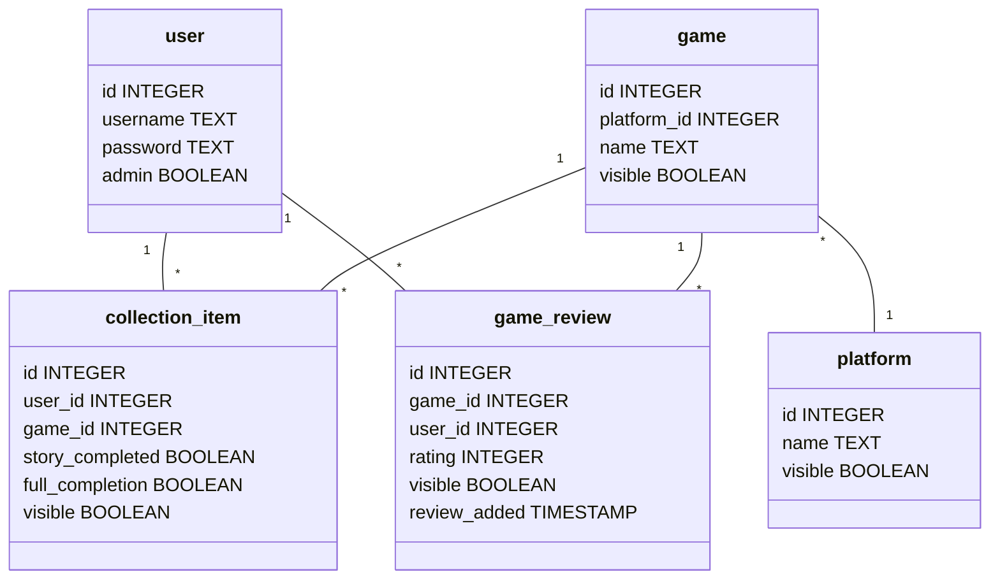

# Videogame Backlog Manager
Sovelluksen avulla käyttäjä voi ylläpitää tietokantaa omistamistaan ja pelaamistaan videopeleistä. Käyttäjä voi lisätä pelejä kokoelmaansa ja tallentaa peliin liittyviä tietoja, kuten onko käyttäjä ehtinyt pelaamaan peliä, onko pelin tarina läpäisty, onko peli suoritettu kokonaisuudessaan ja minkä numeroarvion käyttäjä haluaa antaa pelille. Sovellus myös näyttää etusivulla yhteenvedon suosituimmista peleistä, niiden läpäisyprosenteista ja pelin arvioiden keskiarvon. Linkkien kautta pääsee tarkastelemaan kaikkien pelien listaa ja tarkemmin kunkin pelin tietoja. Jokainen kirjautunut käyttäjä on peruskäyttäjä tai ylläpitäjä.

Sovelluksen ominaisuuksia ovat:
- Kaikki vierailijat voivat tarkastella suosituimpien pelien listaa ja linkkien kautta peleihin liittyviä yhteenvetoja ja arvioita.
- Käyttäjä voi luoda itselleen tunnuksen ja kirjautua sisään ja ulos.
- Käyttäjä voi lisätä sovelluksen tietokannassa olevan pelin omaan kokoelmaansa.
- Käyttäjä voi päivittää omassa kokoelmassaan olevan pelin tietoja.
  - Onko pelin pelaaminen aloitettu.
  - Onko pelin tarina läpäisty.
  - Onko peli pelattu läpi 100%.
- Käyttäjä voi poistaa pelin kokoelmastaan
  - Peli piilotetaan, pelin uudelleen lisääminen tuo pelin uudestaan näkyviin
- Käyttäjä voi kirjoittaa pelistä arvion.
  - Arvio pelistä asteikolla 0-10.
  - Sanallinen arvio pelistä.
  - Arvion näkyvyys muille käyttäjille.
- Ylläpitäjä voi lisätä pelejä sovelluksen tietokantaan.
  - Pelin nimi
  - Pelin alusta (esim. pc, pelikonsoli)
- Ylläpitäjä voi piilottaa pelejä tietokannasta.
- Ylläpitäjä voi lisätä pelialustoja tietokantaan.
- Ylläpitäjä voi piilottaa pelialustoja tietokannasta.

## Tietokannan rakenne
